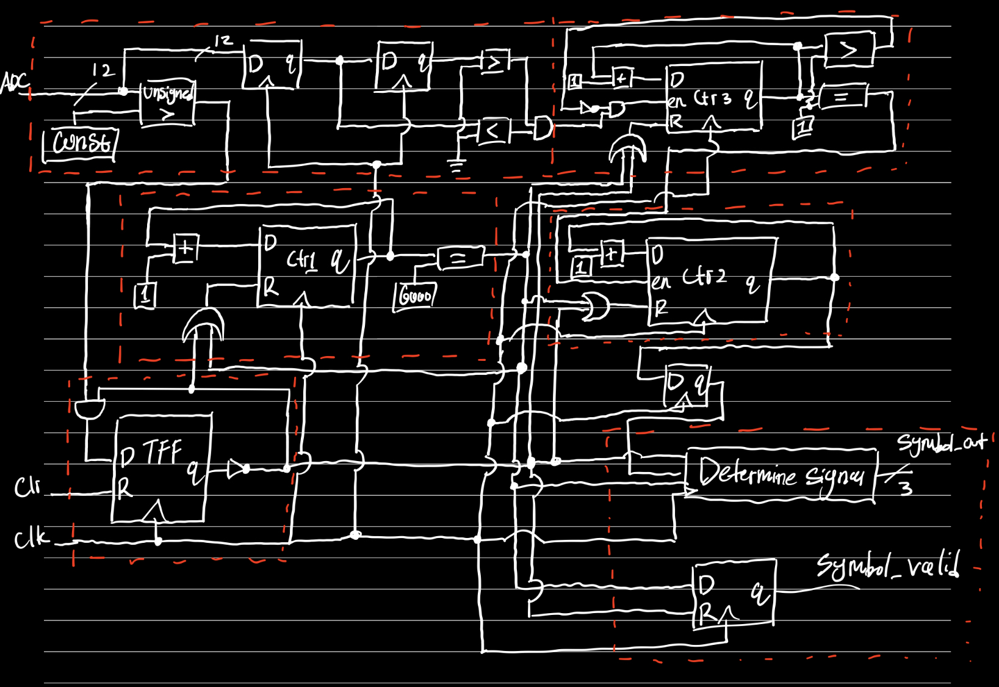
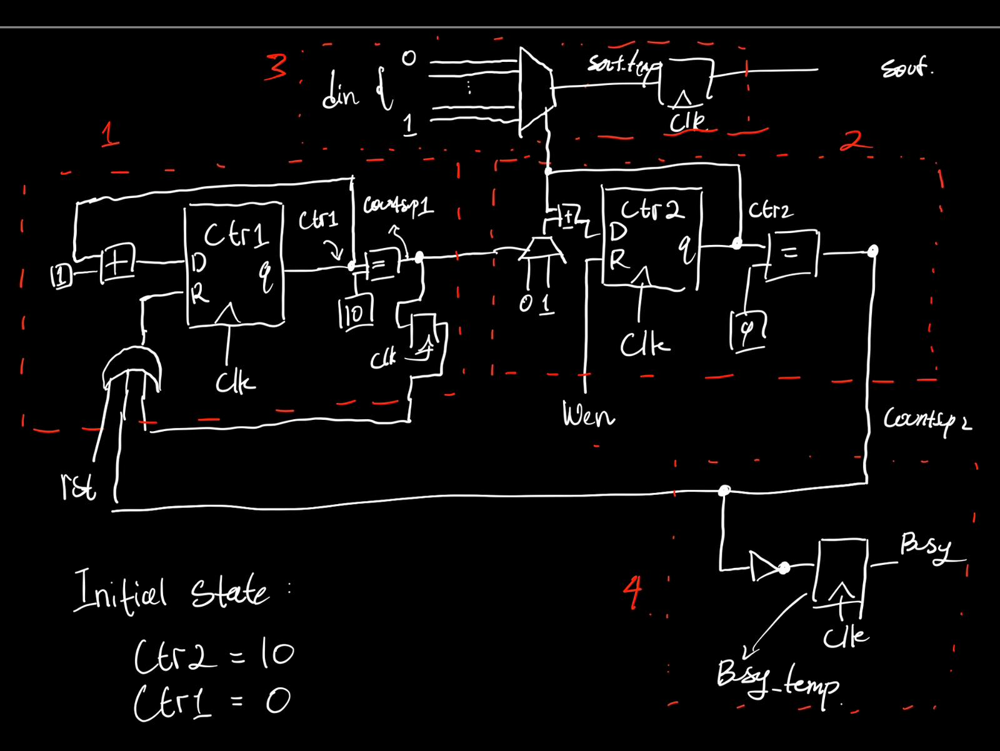
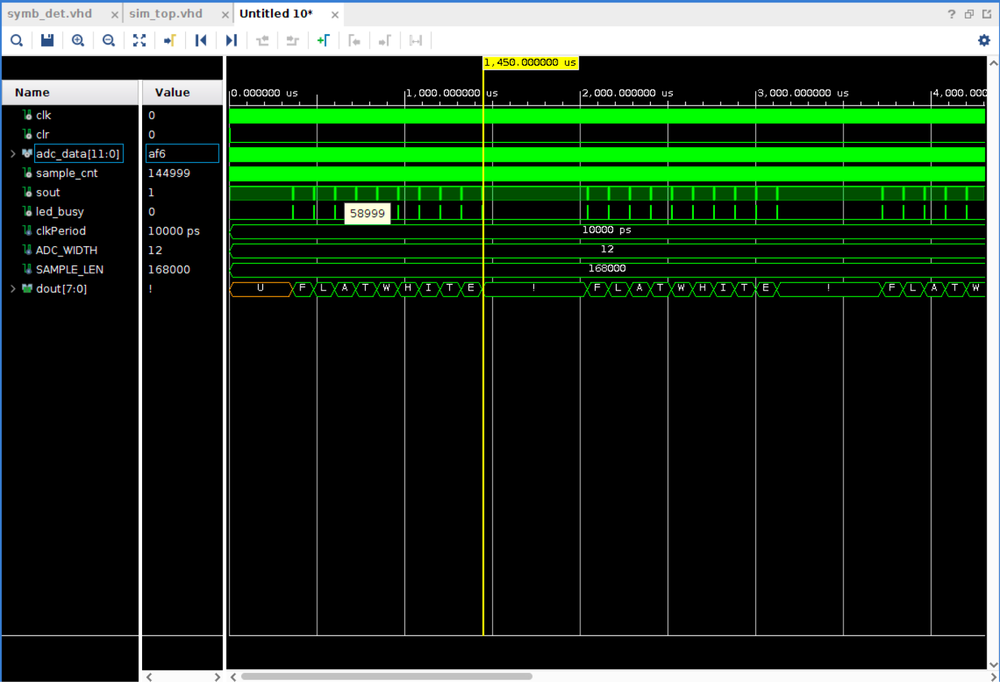
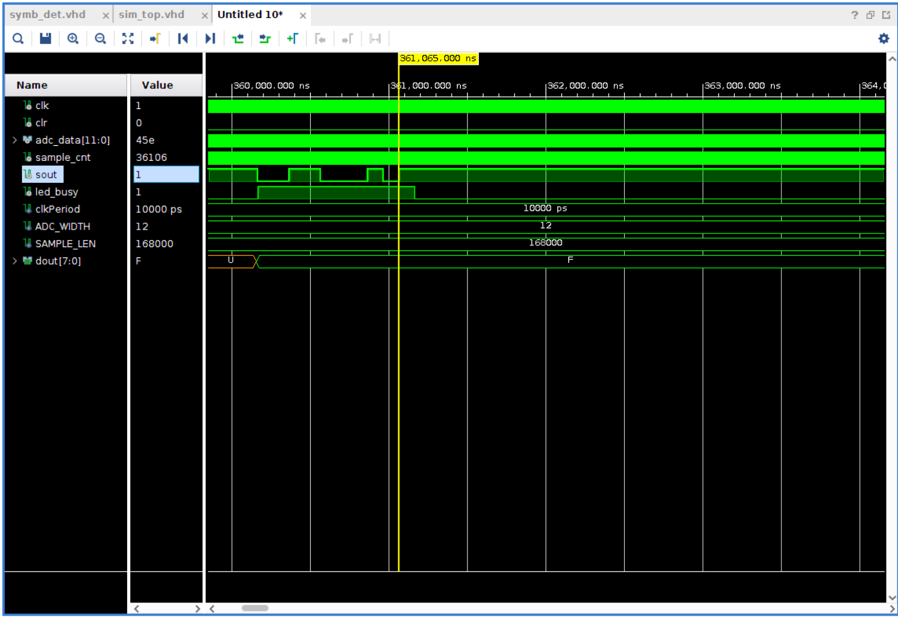

# Introduction

This is a group project for the course **ELEC3342 - Digital Systems Design** at The University of Hong Kong

Group Members:

- `Harsono Abel Haris (3035834345)`
- `Telajaksana Filbert David (3035945699)`
- `Bhardwaj Aryaman (3035858755)`
- `Syed Nafis Ishrak (3035946083)`

Do note that this project is an accumulation of previous projects in the course which all of the members within the team had to also do to pass.

# Files Organization

The meat of this project is in the folders of `src_files` and `tb`. Everything else has to do with the project setup or specific to vivado.

# Description

The system follows as what the course has described with the 3 main components (`symb_det`, `mucodec`, `myuart`) without the FIFO and dpop.

## SYMB_DET

This module consists of 3 clocks named `ctr1`, `ctr2`, `ctr3`. `ctr1` counts for $\frac{1}{16}$ s and reset the other counters. `ctr2` counts how many clock cycles within a single input cycle. `ctr3` counts how many zero crosses have happened respectively.

The module also has a delay line with 2 registers to compare 2 different input values for checking the zero crossing.

`symb_det` will only start operation when it’s no longer quiet. We do this by checking the magnitude of the input value. If greater than some predefined value, it will keep on listening and calculating.

_Figure 1. symb_det_

## MCDECODER

This module is simply an FSM, consisting of the following states:

- `St_RESET` : Starting state and also the state which will be gone back to after clear is asserted. This state will also be inputting “000” which is the starting bit. If input is anything else, it will go to `St_ERROR`
- `St_ERROR` : Error state. This will be asserting a symbol invalid signal, and will go back to `St_RESET` after a clock cycle.
- `LISTENING` : State will also assert symbol invalid signal, but will be waiting for an input of 0-6. Afterwards, it will go to the specific L0-6 state, or if it receives ‘7’ it will go E1, otherwise it will go to `St_ERROR`
- `B1-3`: States will accept din ‘7’, ‘0’, ‘7’ consecutively in that order, and will progress through each Bx state until B3, where it will move to LISTENING after a clock cycle, otherwise it will go to `St_ERROR`.
- `E1-3`: States will accept din ‘0’, ‘7’, ‘0’ consecutively in that order, and will progress through each Ex state until E3, where it will move to `St_RESET` after a clock cycle, otherwise it will go to `St_ERROR`.
- `L0-6`: State represents the first number out of the 2 to be decoded into a character. Each Lx represents the number x. For each Lx state, it will receive the second number for decoding except itself, and go back to LISTENING state, otherwise go to `St_ERROR`.

The component consists of 3 processes as is typical with FSM paradigms: clocking process for async clear and ensure that code runs on a rising edge, next state process to move and route through the states, and an output logic to assert `dout`, `dvalid` and `error`.

## MYUART

The main component of the UART comes down to 2 clocks, `ctr1` and `ctr2`. `ctr1` is used to make sure we can hold the output for 10 clock cycles and `ctr2` is used to cycle through `din` with the start and end bit.

<figure>
    
    <figcaption>Figure 2. myuart</figcaption>
</figure>

# Results

## Milestone 1

We have successfully simulated our design on Vivado. Refer to RESULTS section for proof

## Milestone 2

We have successfully simulated our design on Vivado

## Milestone 3

**Ideas**  
Extend the code table so that it can also include numbers without adding extra frequencies to be generated

**Changes implemented**  
To accommodate for the new encoding, we have decided on extending the code table.

|       |  0  |  1  |  2  |  3  |  4  |   5   |  6  |
| :---: | :-: | :-: | :-: | :-: | :-: | :---: | :-: |
| **0** | NA  |  1  |  2  |  3  |  4  |   5   |  6  |
| **1** |  7  | NA  |  B  |  D  |  H  |   L   |  R  |
| **2** |  8  |  A  | NA  |  G  |  K  |   Q   |  V  |
| **3** |  9  |  C  |  F  | NA  |  P  |   U   |  Z  |
| **4** |  0  |  E  |  J  |  O  | NA  |   Y   |  .  |
| **5** | \[  |  I  |  N  |  T  |  X  |  NA   |  ?  |
| **6** | \]  |  M  |  S  |  W  | \!  | SPACE | NA  |

To match our finite state machine, we simply added the state `L0`, thus making it easily integrated into the system. In the previous design, during `LISTENING` state, if the input is 0, next state would be an error. We have changed this so that it transfers into `L0` instead. We took into account the transition to ending bytes by not implementing the added encoding with sentinel value 7, since that will disrupt the transition into `E1` state.

The new state will be transitioned into when 0 is received and can receive any number between 1 and 6 inclusive for output. If correct input is received, then it will simply output the value according to the table above.
